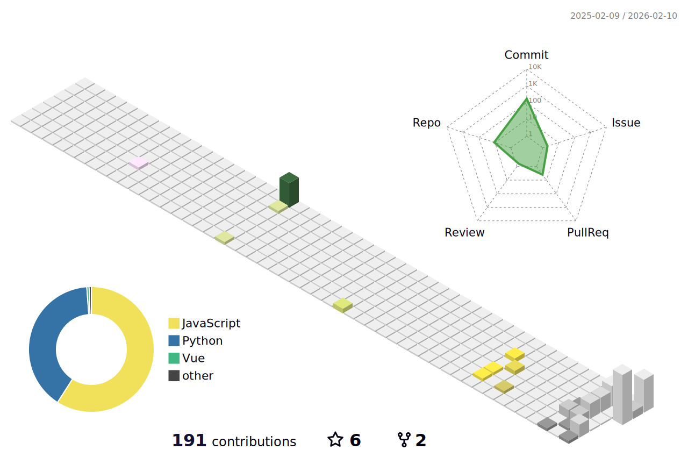

  

## བཀྲ་ཤིས་བདེ་ལེགས (Hello), I'm ZXJC (ZXJC-niusile) 👋

  

  

  

  <strong>Deep Learning Novice | LLM & Multi-modal Enthusiast</strong>
  &nbsp;&nbsp;&nbsp; | &nbsp;&nbsp;&nbsp;
  🎓 <strong>BISTU</strong> Undergraduate
  &nbsp;&nbsp;&nbsp; | &nbsp;&nbsp;&nbsp;
  📍 <strong>Beijing, China</strong>

Hi! I am a developer exploring the world of AI from scratch, currently on a journey to master Deep Learning, LLMs, and Multi-modal AI. My motto is 'Destroyed them!' 🫒

  🌐 <strong>Blog:</strong> <a href="https://zxjc-niusile.github.io/">zxjc-niusile.github.io</a> |
  🆔 <strong>ORCID:</strong> <a href="https://orcid.org/0009-0009-7380-3094">0009-0009-7380-3094</a> |
  📧 <strong>Email:</strong> <a href="mailto:2632590648@qq.com">2632590648@qq.com</a>

 

  

 

  

 

<table>
  <tr>
    <td width="50%" valign="top" style="padding-left: 20px;">
      <h3>🚀 About Me</h3>
      <ul>
        <li>🌱 <strong>Status:</strong> Novice in Deep Learning.</li>
        <li>🔭 <strong>Interests:</strong>
          <ul>
            <li>Multi-modal Large Models & LLMs</li>
            <li>GNN & Information Retrieval</li>
          </ul>
        </li>
      </ul>
    </td>
    <td width="50%" valign="center" align="center">
      

        
      

    </td>
  </tr>

  <tr>
    <td width="50%" valign="center" align="center">
      

        
      

    </td>
    <td width="50%" valign="top" style="padding-left: 20px;">
      <h3>🌟 Open Source Contributions</h3>
      <ul>
        <li><strong><a href="https://github.com/tensorlayer/TensorLayerX">TensorLayerX</a></strong> 
          I am a <strong>Contributor</strong> to this Unified Deep Learning Framework.
        </li>
      </ul>
    </td>
  </tr>

  <tr>
    <td width="50%" valign="top" style="padding-left: 20px;">
      <h3>💻 Coursework & Practice</h3>
      <ul>
        <li><strong><a href="https://github.com/ZXJC-niusile/JudoPro-Backend">JudoPro-Backend</a> (Java)</strong> 
          Backend for IR course project.
        </li>
        <li><strong><a href="https://github.com/ZXJC-niusile/huawei_carousel_backend">Carousel Framework</a> (Python)</strong> 
          Demo for Huawei Developer Alliance.
        </li>
      </ul>
    </td>
    <td width="50%" valign="center" align="center">
      

        
      

    </td>
  </tr>
</table>

 

  

